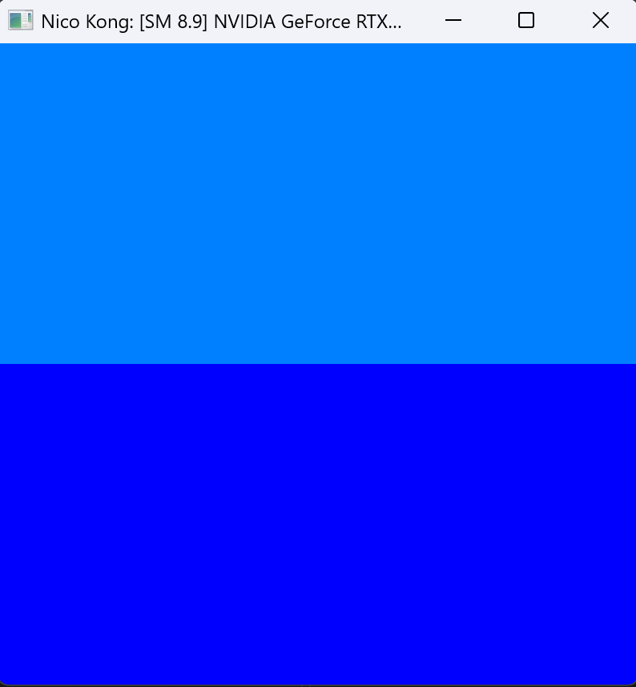
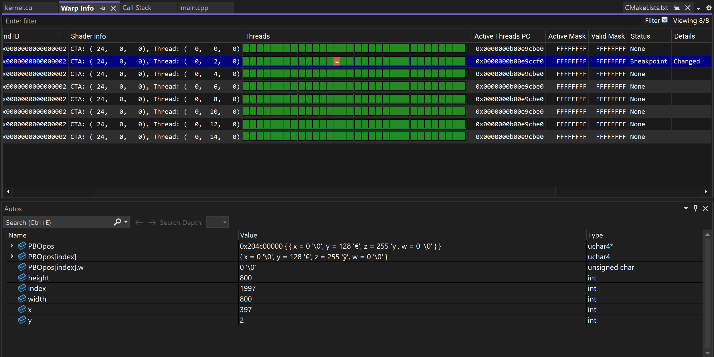
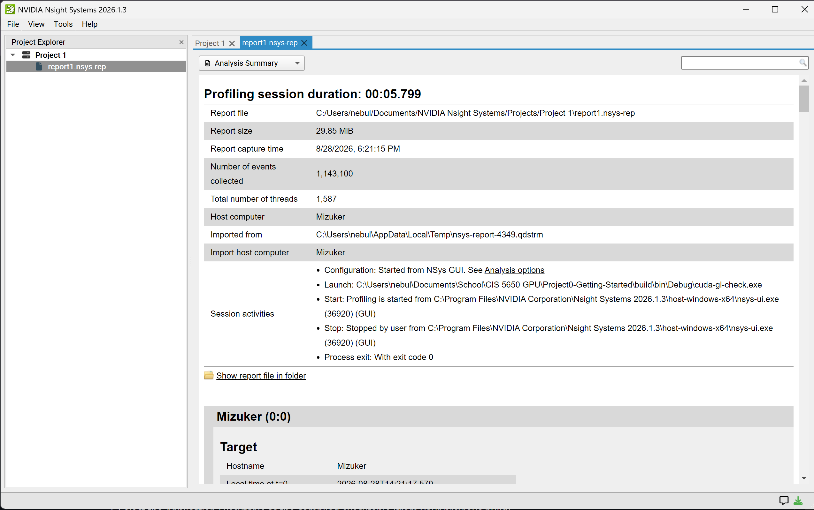
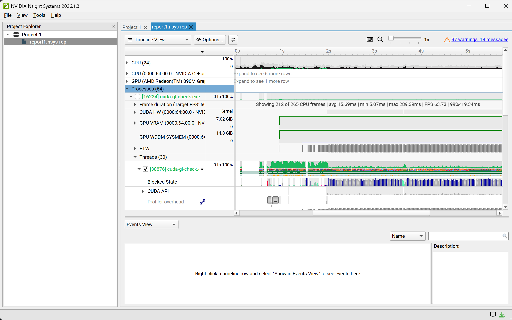
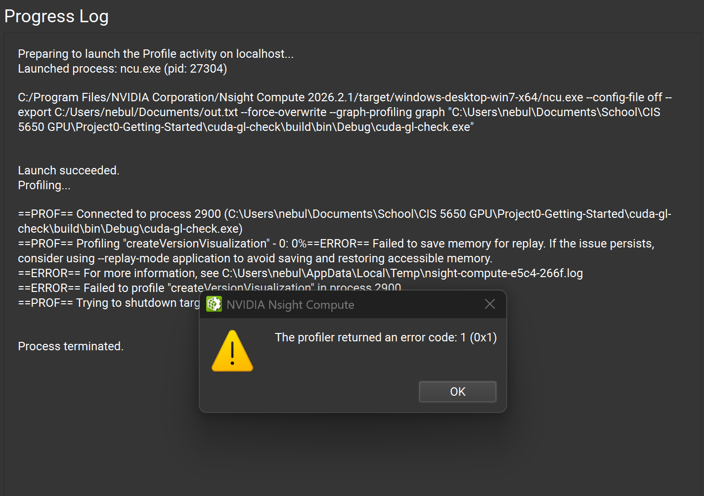
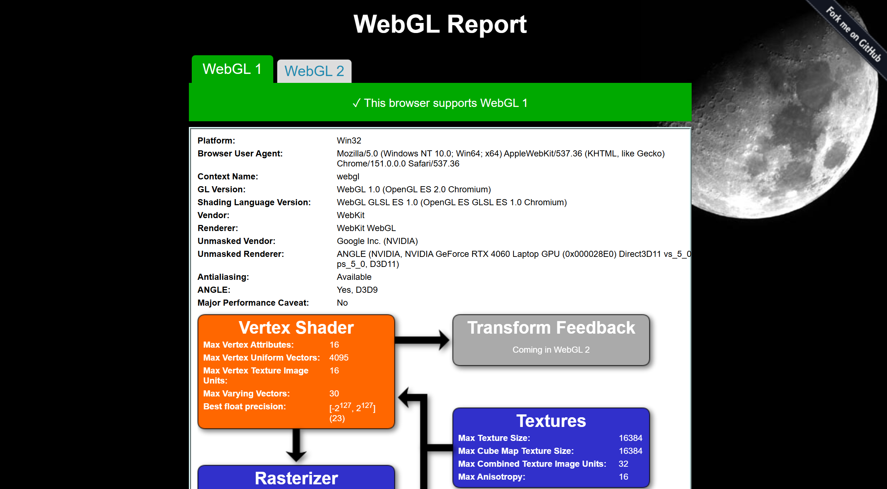
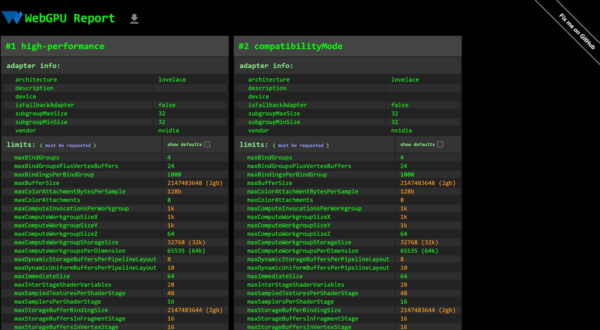

Project 0 Getting Started
====================

**University of Pennsylvania, CIS 5650: GPU Programming and Architecture, Project 0**

* Nico Kong
   [LinkedIn](https://www.linkedin.com/in/nicola-kong/), [Email](nebfinn@gmail.com)
* Tested on: Windows 11, AMD Ryzen AI 9 HX 370 @ 2.0GHz 32GB, GTX 4060 8GB (Personal Laptop)

###

Screenshots:

